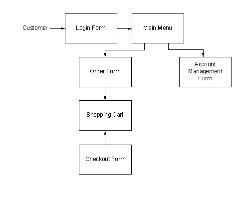

# System Design

## Level 1: The Database & the 3 Components
---
>The structure of the system can be divided into three main logical components. The first component must provide some form of menu management, allowing the restaurant to control what can be ordered by customers. The second component is the web ordering system and provides the functionality for customers to place their order and supply all necessary details. The third and final logical component is the order retrieval system. Used by the restaurant to keep track of all orders which have been placed, this component takes care of retrieving and displaying order information, as well as updating orders which have already been processes.

## Level 2: Web Ordering System Components
>The web ordering system is comprised of 6 major components. These are the login form, the main menu, the account management form, the order form, the shopping cart, and the checkout form. When the customer first arrives at the site, they are presented with the login form. After either signing in or, if they do not yet have an account, first registering and then signing in, the user is taken to a welcome page with the main menu. 
---
>From here, they have two options – they can either change their password and other preferences through the account management form, or they can select an order form and begin adding items to their order. If they choose the second path, they can navigate the numerous order forms using the main menu, each of which corresponds to a specific category of order items, adding items to their shopping cart along the way.
---
> At any time they can view and modify their shopping cart and when they are finally ready to place their order, they can proceed to the checkout form. The checkout form uses the contents of the shopping cart to present a summary of the order and to calculate the total cost, in addition to allowing the user to specify all of the necessary delivery details.
---
---

>Level 3: The Login Form
	The login form is standard for a form of this type. It provides text fields for username and password, which the user must enter before signing in. This form also gives the option for a user to register for the site if they have not yet done so.
    ---	
>Level 3: The Main Menu
	The main menu, found at the top of the screen like in most applications, presents the user with two levels of selections. They must first choose the vendor they would like to view and then choose a category of food. Once they make these two selections, the application generates an order form specifically for that type of food, and displays this form to the user.
    ---
>Level 3: The Account Management Form
	Currently the account management form only offers the user the option to change their password.
>Level 3: The Order Form
	The order form, which is dynamically generated based on selections from the main menu, 
>Level 3: The Shopping Cart
	The shopping cart performs much like a shopping cart in any other application. After an item is added to the order, it is displayed, along with its price, in the shopping cart. The shopping cart also keeps a running total of the current price of the whole order. By clicking on an item in the shopping cart, the user can review all of the details for that particular item. Finally, the shopping cart contains a button for the user to proceed to checkout.
    ---
>Level 3: The Checkout Form
	The checkout form is the user’s last chance to verify that the contents of their order are correct before actually placing it. This form also provides fields for the user to supply all of the necessary checkout and delivery details (payment type, delivery address, etc.).
    ---
>Level 2: Menu Management System Components
	In order to make use of the menu management system, the user must interact with the navigation tree, which uses a hierarchical tree structure to display all of the vendors, categories of foods, and specific food items stored in the system. When the user selects an item from this tree, they are able to edit the item using the appropriate form – a Vendor Form if a vendor is selected, a Category Form if a category of foods is selected, and a Food Form if an individual food item is selected.

---
---
>Level 3: The Navigation Tree
	>>The navigation tree is a 3-level (excluding the root) hierarchical arrangement, with each leaf corresponding to a form. At the first level are vendors, at level two categories of food, and at level 3 individual food items. When a leaf is selected, it brings up a form corresponding to the item at that leaf.
>Level 3: The Forms
	>>There are three types of forms in the menu management system - Vendor Forms, Category Forms, and Food Forms. The three forms are all similar, allowing the user to add, edit, and remove information relevant to the selected item. Where they differ is in the specific fields that the user is able to edit. After changes to any of the forms are saved, the necessary records in the database are updated.
    
	---

---
---
# Testing Design

## Testing
### Phases
>The structure of the system can be divided into three main logical components, plus the database, which is invisible to the end user. Each of these components must be tested individually, and the approaches which will be used for each component are described in the following sections.
---
>Database
	>>Testing of the database component is very straightforward, and has actually already been mostly completed. The database was the first component designed and before beginning work on any of the applications, I wrote all of the SQL statements I expected to need and executed them directly, essentially isolating the database, using the psql client. By doing this I was able to reveal, and promptly fix a large percentage of the errors within the database itself.

>Web Ordering System
	>>Testing of the web ordering system will be the most strenuous, as it is the component that will see the highest frequency of use and will be exposed to the most users, which leads to a higher potential of failure. Testing here will be divided into two phases. During normal use case testing I will execute all of the functions available through the web interface using a broad spectrum of reasonable values that a user would be expected to input. In addition to simply observing the in-application effects, I will also be monitoring and inspecting the JSON requests and responses (using Firebug) to make sure that everything is sent and received correctly.
---

